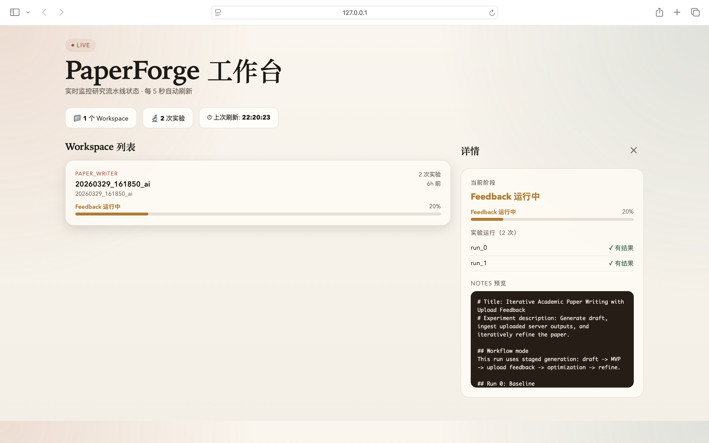

# PaperForge

**面向研究论文生成、实验驱动写作与迭代修订的自动化研究流水线。**

## 功能概述

PaperForge 将 idea 生成、实验编码、云端训练和 LaTeX 论文写作串联为单一 Agent 循环，支持多种 LLM 后端（Anthropic、OpenAI、Gemini、DeepSeek）。

两条工作流主线：

- `scientist` — 全自动：idea → experiment → writeup → review → improvement
- `mvp` — 分阶段：bootstrap → feedback → optimize → refine → cloud



## 快速开始

### 1. 环境准备

```bash
python3.11 -m venv .venv311
source .venv311/bin/activate
pip install -r requirements.txt
```

### 2. 配置 API Key

```bash
cp key.example.sh key.sh
# 编辑 key.sh，填入 API Key
source key.sh
```

### 3. 运行 MVP 流程

```bash
# 完整流程
python launch_mvp_workflow.py \
  --phase all \
  --experiment paper_writer \
  --idea-name "My Research Idea" \
  --engine openalex

# 单阶段运行
python launch_mvp_workflow.py --phase bootstrap --experiment paper_writer
```

### 4. 运行 Scientist 流程

```bash
python launch_scientist.py \
  --experiment paper_writer \
  --num-ideas 1 \
  --skip-novelty-check
```

### 5. 查看前端控制台

```bash
# 列出所有 workspace
python -m frontend.console

# 查看单个 workspace 详情
python -m frontend.console --workspace results/<experiment>/<run>/

# 自动刷新（每5秒）
python -m frontend.console --watch 5

# 查看写作 Prompt 目录
python -m frontend.console --prompts

# 查看指定 Prompt 内容
python -m frontend.console --prompt '去AI味'
```

## 项目结构

```text
PaperForge/
├── launch_user_entry.py        # 统一入口
├── launch_mvp_workflow.py      # MVP 流程编排
├── launch_scientist.py         # Scientist 流程
├── engine/                     # 核心引擎
│   ├── llm.py                  # LLM client 统一封装
│   ├── mvp_workflow.py         # workspace 生命周期
│   ├── generate_ideas.py       # idea 生成 + 文献检索
│   ├── perform_experiments.py  # 实验运行
│   ├── perform_writeup.py      # LaTeX 写作（含降重提示词）
│   ├── perform_review.py       # 自动评审
│   └── remote_runner.py        # SSH 远程执行
├── agents/                     # Agent bridge 层
│   ├── coordinator.py
│   ├── mvp_workflow_agent.py
│   ├── scientist_workflow_agent.py
│   └── writeup_agent.py
├── mcp_servers/                # MCP 工具接口层
│   ├── literature_search.py    # 文献检索工具
│   ├── workspace_reader.py     # workspace 只读查询
│   ├── latex_compile.py        # LaTeX 编译工具
│   └── diagram_tool.py         # 架构图工具
├── frontend/                   # 前端控制台
│   ├── console.py              # CLI 状态控制台
│   └── status_snapshot.py      # JSON 快照导出
├── skills/                     # 写作 Skill 包
│   ├── write-section/
│   ├── refine-section/
│   ├── citation-gap/
│   ├── citation-select/
│   ├── latex-fix/
│   ├── de-aigc-rewrite/
│   └── research-writing-prompts/  # 写作 Prompt 库
├── templates/                  # 实验模板
│   └── paper_writer/
├── results/                    # 运行结果（git-ignored）
└── tests/                      # 测试套件
```

## 关键环境变量

| 变量 | 用途 |
|---|---|
| `ANTHROPIC_API_KEY` | Anthropic 原生协议 |
| `OPENAI_API_KEY` / `OPENAI_BASE_URL` | OpenAI 兼容端点 |
| `OPENALEX_MAIL_ADDRESS` | OpenAlex 文献检索（礼貌池访问）|
| `S2_API_KEY` | Semantic Scholar API（可选）|
| `WRITEUP_CITE_ROUNDS` | 引用轮数（默认 4）|
| `WRITEUP_LATEX_FIX_ROUNDS` | LaTeX 修错轮数（默认 2）|
| `MPLBACKEND=Agg` | macOS 无头 matplotlib |
| `PAPERFORGE_ALLOW_SYSTEM_PYTHON=1` | 跳过 venv 检查 |

## MVP 阶段说明

| 阶段 | 功能 |
|---|---|
| `bootstrap` | 创建 workspace、初始化 notes、文献检索、基线实验 |
| `feedback` | 读取上传结果、更新 notes、初版写作 |
| `optimize` | 多轮实验迭代（aider 代码 Agent）|
| `refine` | LaTeX 精修 + 降重 + 引用补全 |
| `cloud` | 上传至远程 GPU 训练、下载结果 |
| `all` | 依次执行 bootstrap → feedback → optimize → refine |

## 使用限制

- 禁止商用
- 仅限个人、学术研究、非营利教育使用
- 禁止用于 surveillance、deceptive media、未授权医疗/犯罪预测等场景
- 使用本工具生成的论文必须在显著位置声明 AI 辅助生成

详见 `LICENSE`。
