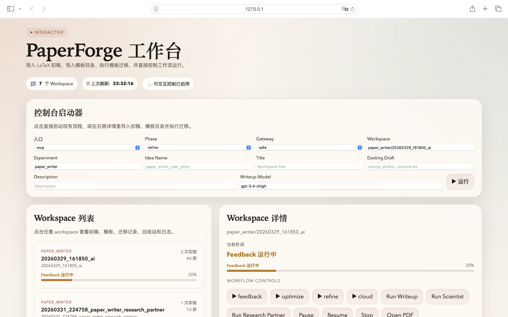
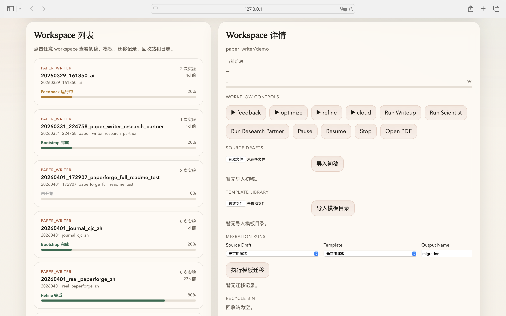
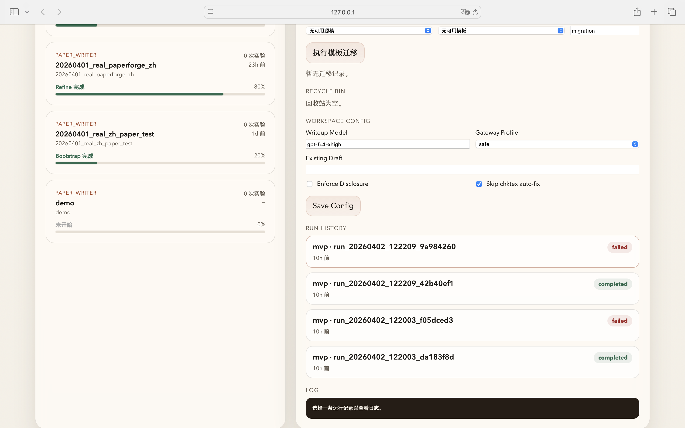

# PaperForge

面向研究论文生成、实验驱动写作、现有成稿精修与模板迁移的自动化工作台。

<p align="center">
  <a href="https://linux.do" target="_blank">
    
  </a>
</p>

> ⚠️ 免责声明：本项目仅供学习与研究使用，不得用于任何商业用途。使用本项目所产生的一切后果由使用者自行承担。

PaperForge 将文献检索、实验编排、LaTeX 写作、Proposal-first 收敛、浏览器前端控制台以及模板迁移整合为一套可脚本化流程。当前发布版聚焦于可直接运行、可点击操作、可查看历史记录的本地工作流体验。

## 当前主线

- `research_partner`：证据摄入 → idea framing → claim graph → critique → proposal artifacts
- `mvp`：bootstrap → feedback → optimize → refine → cloud
- `scientist`：idea → experiment → writeup → review → improvement
- `writeup`：对现有 workspace 或 scientist folder 单独触发写作/编译
- `template migration`：导入现有 `.tex` 初稿与目标模板目录，迁移并同步渲染 PDF

## 界面预览

### 浏览器工作台





## 安装与启动

### 1. 环境准备

```bash
python3.11 -m venv .venv311
source .venv311/bin/activate
pip install -r requirements.txt
```

### 2. 配置 API

```bash
cp key.example.sh key.sh
# 编辑 key.sh，填入你的 API Key / Base URL
source key.sh
```

### 3. 启动浏览器前端

```bash
source .venv311/bin/activate
python frontend/server.py
```

然后在浏览器打开：

```text
http://127.0.0.1:8080
```

当前前端支持：

- 点击启动 `mvp / scientist / research_partner / writeup`
- 点击 `Pause / Resume / Stop`
- 点击打开 PDF / TEX / compile log
- 导入 LaTeX 初稿
- 导入目标模板目录
- 执行模板迁移
- 查看历史记录与回收站
- 编辑 workspace 级配置

## LaTeX 初稿与模板迁移

当前迁移能力为 **LaTeX v1**：

- 初稿只支持 `原始 .tex`
- 可附带一个 `preview.pdf` 作为预览
- 可附带 figures / bib / cls / sty 等伴随资源
- 目标模板来自 **用户上传的 LaTeX 模板目录**
- 支持：
  - 已知模板 profile：`ieee_tii`、`cjc`
  - 或目录中自带 `paperforge_template.json` 的自定义模板
- 迁移完成后会自动生成：
  - `migrations/<migration_id>/output/main.tex`
  - `migrations/<migration_id>/output/main.pdf`
  - workspace 根目录下的 `migrated_<template_id>.tex`
  - workspace 根目录下的 `migrated_<template_id>.pdf`

### 独立迁移命令

```bash
source .venv311/bin/activate
python launch_template_migration.py \
  --workspace results/paper_writer/<run_name> \
  --source-draft-id <draft_id> \
  --template-id <template_id> \
  --output-name release_migration
```

## 现有成稿 refine

如果你已经有一份 `.tex` 主稿，可以直接走正式化的 `--existing-draft` 接口：

```bash
source .venv311/bin/activate
source key.sh

python launch_mvp_workflow.py \
  --phase refine \
  --run-dir results/paper_writer/<run_name> \
  --existing-draft /absolute/path/to/manuscript.tex \
  --gateway-profile safe \
  --writeup-model gpt-5.4-xhigh \
  --engine openalex \
  --no-enforce-disclosure \
  --skip-chktex-fix
```

当前推荐默认网关档位：

- `safe`：`stream=False`, `max_tokens=4096`, `reasoning_effort=low`
- `full`：仅在你明确需要更高生成强度时使用

## 统一入口示例

### Research Partner

```bash
python launch_user_entry.py research_partner \
  --claude-protocol openai \
  --openai-api-key "$OPENAI_API_KEY" \
  --experiment paper_writer \
  --title "Evidence-first Research Session" \
  --description "Bootstrap a research partner workspace with evidence files." \
  --engine openalex \
  --rubric-profile cvpr \
  --evidence-file /absolute/path/paper.pdf \
  --evidence-file /absolute/path/results.csv
```

### MVP

```bash
python launch_user_entry.py mvp \
  --claude-protocol openai \
  --openai-api-key "$OPENAI_API_KEY" \
  --phase refine \
  --run-dir results/paper_writer/<run_name> \
  --gateway-profile safe \
  --writeup-model gpt-5.4-xhigh
```

### Scientist

```bash
python launch_user_entry.py scientist \
  --claude-protocol openai \
  --openai-api-key "$OPENAI_API_KEY" \
  --experiment paper_writer \
  --model gpt-5.4-xhigh \
  --gateway-profile safe \
  --num-ideas 1 \
  --skip-novelty-check
```

### Writeup

```bash
python launch_user_entry.py writeup \
  --claude-protocol openai \
  --openai-api-key "$OPENAI_API_KEY" \
  --workflow-kind mvp \
  --workspace results/paper_writer/<run_name> \
  --gateway-profile safe \
  --writeup-model gpt-5.4-xhigh
```

## 目录概览

```text
PaperForge/
├── launch_user_entry.py
├── launch_mvp_workflow.py
├── launch_scientist.py
├── launch_template_migration.py
├── engine/
│   ├── llm.py
│   ├── mvp_workflow.py
│   ├── perform_writeup.py
│   ├── template_migration.py
│   └── workspace_config.py
├── frontend/
│   ├── server.py
│   ├── app.js
│   └── process_manager.py
├── templates/
│   └── paper_writer/
├── docs/images/
├── agents/
└── tests/
```

## 测试

发布前推荐验证：

```bash
source .venv311/bin/activate
python -m pytest \
  tests/test_perform_writeup.py \
  tests/test_template_migration.py \
  tests/test_agent_bridges.py \
  tests/test_research_partner_pipeline.py \
  tests/test_frontend_process_manager.py \
  tests/test_frontend_api.py \
  tests/test_server_security.py \
  -q
```

当前本地结果：`98 passed`

同时建议再跑：

```bash
node --check frontend/app.js
python frontend/server.py
```

## 当前边界

- 这版只支持 **LaTeX 主线**，不支持 Word/docx
- 模板迁移 v1 只覆盖：
  - `ieee_tii`
  - `cjc`
  - 或带 `paperforge_template.json` 的自定义模板
- `Pause / Resume` 采用 POSIX 进程组信号，面向 macOS/Linux
- 前端通过浏览器工作台操作，不再维护旧的 `frontend.console` 只读模式

## 许可证

详见 [LICENSE](LICENSE)
