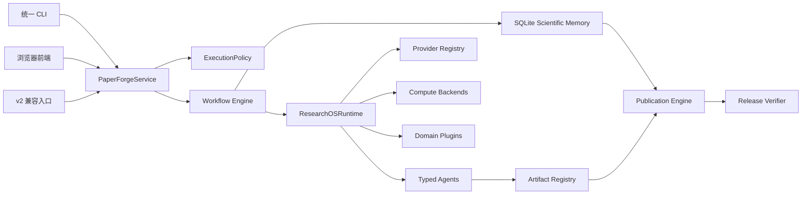

# PaperForge Research OS v3

<p align="center">
  <a href="https://github.com/QJHWC/PaperForge/actions/workflows/ci.yml">
    
  </a>
  
  
  <a href="https://linux.do" target="_blank">
    
  </a>
</p>

PaperForge v3 是一个以证据为中心的科研工作系统，用于研究规划、受控实验、
论文写作、同行审查、排版发布和交付验证。CLI、浏览器前端以及兼容入口最终都
进入同一套工作流数据库、执行策略、Agent Runtime、Provider Registry、
Artifact Registry 和 Release Verifier。

> ⚠️ 免责声明：本项目仅供学习与研究使用，不得用于任何商业用途。使用本项目所产生的一切后果由使用者自行承担。

## 目录

- [v3 相比 v2 的变化](#v3-相比-v2-的变化)
- [核心架构](#核心架构)
- [安装](#安装)
- [配置模型和 Key](#配置模型和-key)
- [快速开始](#快速开始)
- [工作流与命令](#工作流与命令)
- [科研可信度与发布](#科研可信度与发布)
- [计算、插件和浏览器前端](#计算插件和浏览器前端)
- [从 v2 迁移](#从-v2-迁移)
- [安全、测试与许可证](#安全测试与许可证)

## v3 相比 v2 的变化

v2 主要提供多个相对独立的自动写作与实验入口；v3 将项目升级为统一的
Research OS，并把科研断言、实验来源和发布结果纳入可验证状态。

| 能力 | v2 | v3 |
|---|---|---|
| 运行入口 | `writeup`、`research_partner`、`mvp`、`scientist` 各自维护流程 | 所有入口转入统一 `PaperForgeService` 和 `ResearchOSRuntime` |
| 执行权限 | 主要依靠调用约定和提示词 | `writing-only`、`research`、`full` 三种强制策略 |
| 科研证据 | 文档和结果文件分散保存 | SQLite Scientific Memory 统一保存 Claim、Evidence、Run 和 Artifact |
| 实验流程 | 工作流内部直接组织实验 | Proposal → Static Check → Mini Experiment → Full Experiment，并要求审批 |
| 论文发布 | 基础 LaTeX 写作和模板迁移 | Claim Gate、四种模板、编译渲染闭环、保护块和最终发布门禁 |
| 计算后端 | 本地与远程脚本分别处理 | Local、Docker、SSH、Slurm、Kubernetes、Cloud SSH 使用统一接口 |
| Provider | 不同路径分别传递模型和 Key | 统一 Provider Registry、请求过滤、认证预检和失败关闭 |
| 安全与交付 | 基础日志处理 | 全链路脱敏、秘密扫描、第三方锁定、确定性源码包和发布验证 |

### v3 的主要能力

1. **统一 Research OS**：Research、Experiment、Code、Compute、Analysis、
   Visualization、Paper、Reviewer 和 Release Agent 共享同一运行时。
2. **科学证据数据库**：论文中的公开断言必须通过 `claim_id` 关联源码、
   文献、运行结果、实验结果或许可证证据。
3. **受控实验系统**：实验必须经过提案、静态检查、小实验和正式实验，
   并保存代码、配置、数据、权重、指标和产物哈希。
4. **正式出版流水线**：支持 Generic、CVPR、IEEE、Elsevier，并进行最多三轮
   编译、渲染、诊断和受限排版修复。
5. **可验证发布**：只有 Claim、PDF、保护块、页面检查、秘密扫描和发布清单
   全部通过，工作流才能进入 `COMPLETED`。

## 核心架构



### 持久状态

每个 workspace 都有独立状态目录：

```text
<workspace>/
├── .paperforge/
│   ├── paperforge.db
│   ├── runtime/
│   ├── publication/
│   └── release_manifest.json
├── artifacts/
├── dist/
├── main.tex
└── references.bib
```

`.paperforge/paperforge.db` 保存工作流、事件、审批、来源、证据、断言、实验、
产物和审查结果。写入操作使用版本号、幂等键和事务，异常中断后可以通过
`paperforge resume` 恢复。

## 安装

### 环境要求

| 项目 | 要求 |
|---|---|
| Python | 3.10、3.11 或 3.12 |
| 操作系统 | macOS、Linux、Windows |
| 基础安装 | Git、Python、pip、venv |
| 论文发布 | `latexmk` 或 `pdflatex`、BibTeX、Poppler 的 `pdftoppm` |
| 扩展计算 | 根据后端安装 Docker、OpenSSH、Slurm、kubectl/Kind 等工具 |

没有安装 LaTeX 或 Poppler 时，研究和状态管理功能仍可使用，但
`paperforge publish` 无法完成正式 PDF 发布。

### 1. 克隆项目

```bash
git clone https://github.com/QJHWC/PaperForge.git
cd PaperForge
git checkout v3.0.0
```

如果需要跟随后续更新，可以保留在 `main`，不执行最后一行。

### 2. macOS / Linux

```bash
python3.12 -m venv .venv
source .venv/bin/activate
python -m pip install --upgrade pip
python -m pip install -e ".[writing]"
paperforge preflight --workspace .
```

### 3. Windows PowerShell

```powershell
py -3.12 -m venv .venv
.\.venv\Scripts\Activate.ps1
python -m pip install --upgrade pip
python -m pip install -e ".[writing]"
paperforge preflight --workspace .
```

### 依赖组合

| 安装命令 | 用途 |
|---|---|
| `python -m pip install -e .` | Research OS 核心、状态和基础 CLI |
| `python -m pip install -e ".[writing]"` | 模型调用、文献、PDF 和论文写作 |
| `python -m pip install -e ".[research]"` | 额外研究 Provider |
| `python -m pip install -e ".[experiment]"` | 实验、训练和远程计算依赖 |
| `python -m pip install -e ".[dev]"` | Pytest、Ruff、Mypy 等开发工具 |

完整开发环境：

```bash
python -m pip install -e ".[writing,research,experiment,dev]"
```

只使用论文写作时不需要安装 PyTorch、Transformers、Datasets 或训练栈。

## 配置模型和 Key

### 配置目录

PaperForge 不接受明文 Key 命令行参数，也不会把 Key 写入 workspace。

```text
macOS / Linux: ~/.config/paperforge/
Windows:       C:\Users\<用户名>\.config\paperforge\
```

当前 v3 正式写作路径固定使用 `bailu` Provider 和 `bailu-turing` 模型。
不要依赖 `config.json` 切换生产写作模型；当前 CLI 运行时不会把其中的
`provider`、`model` 或 `generation_profile` 注入写作 Agent。

创建 `credentials.json`：

```json
{
  "bailu_primary": "<在这里填写你的 Key>"
}
```

macOS 和 Linux 必须限制凭据文件权限：

```bash
chmod 600 ~/.config/paperforge/credentials.json
```

Windows 会检查文件 ACL，凭据文件不能向其他用户开放。

### Bailu 配置

`bailu-turing` 使用 OpenAI-compatible 协议，默认 Base URL 为：

```text
https://bailucode.com/openapi/v1
```

统一请求构造器会自动移除 Bailu 不支持的字段：
`reasoning_effort`、`seed`、`n`、`stop`，并在 single、batch、review、
citation、stream 和 Aider 路径中使用相同规则。

如确实需要覆盖兼容网关地址，可以设置一个 Base URL：

```bash
export OPENAI_BASE_URL="https://your-compatible-gateway.example/v1"
```

不要同时设置互相冲突的 `OPENAI_BASE_URL`、`OPENAI_WRITEUP_BASE_URL` 和
`OPENAI_API_BASE`；PaperForge 检测到冲突后会直接停止。

### 认证预检

静态环境检查：

```bash
paperforge preflight --workspace .
```

增加一次最小真实 Provider 请求：

```bash
paperforge preflight \
  --workspace . \
  --model bailu-turing \
  --live-provider
```

状态含义：

| 状态 | 含义 |
|---|---|
| `CODE_VERIFIED` | Python 和 workspace 基础条件可用 |
| `EXTERNAL_SERVICE_VERIFIED` | 最小 Provider 请求成功 |
| `AUTH_BLOCKED` | 没有 Key，或服务返回 401/403 |
| `FAILED` | Python 版本不受支持、workspace 不可用，或显式实时检查发生配置/网络错误 |

静态 `preflight` 的顶层状态只反映 Python 和 workspace 是否可用；输出中的
`latex_compiler`、`bibtex` 和 `pdftoppm` 字段分别报告出版工具是否存在。
缺少这些工具不会把静态预检改成 `FAILED`，但后续 `paperforge publish` 无法
通过相应发布门禁。只有显式传入 `--live-provider` 时才会访问 Provider。
`AUTH_BLOCKED` 不会触发长文本重试，也不会继续产生大额生成请求。

## 快速开始

### 只使用写作功能

```bash
mkdir -p workspace/my-paper

paperforge run \
  --profile writing-only \
  --workspace workspace/my-paper \
  --title "论文标题" \
  --topic "研究主题" \
  --instructions "只完成论文写作，不运行训练、推理或实验"
```

查看最新状态：

```bash
paperforge status --workspace workspace/my-paper
```

恢复中断任务：

```bash
paperforge resume --workspace workspace/my-paper
```

`writing-only` 会在策略、工具注册、命令和上下文四层拒绝：

- 训练、推理和实验命令；
- SSH、容器和远程计算；
- `.pt`、`.pth`、`.ckpt`、`.onnx` 等权重；
- CSV、NumPy、Parquet 等实验数据；
- `run_*` 结果目录和可执行实验脚本。

### 使用写作任务清单

任务清单必须位于 workspace 内，最大 1 MiB。例如
`workspace/my-paper/writing-job.json`：

```json
{
  "schema": "paperforge.writing-job/v1",
  "title": "论文标题",
  "topic": "研究主题",
  "abstract": "现有摘要",
  "instructions": "只修改写作部分，保持实验保护块不变",
  "main_tex": "main.tex",
  "bibliography_path": "references.bib",
  "reference_paths": [
    "references/source-paper.pdf"
  ]
}
```

运行：

```bash
paperforge run \
  --profile writing-only \
  --workspace workspace/my-paper \
  --job-manifest writing-job.json
```

写作上下文只接受 `.bib`、`.docx`、`.md`、`.pdf`、`.rst`、`.tex` 和
`.txt` 文档，不能通过任务清单绕过执行策略。

## 工作流与命令

### 三种执行模式

| Profile | 允许的操作 | 典型用途 |
|---|---|---|
| `writing-only` | 证据阅读、引用、写作、LaTeX 编译、页面检查 | 已有实验结果，只完成论文 |
| `research` | 写作能力 + 文献研究、研究规划、实验提案 | 形成研究问题和 Proposal |
| `full` | 审批后的代码、实验、计算、分析、可视化和发布 | 完整科研工作流 |

### 统一 CLI

| 命令 | 作用 |
|---|---|
| `paperforge preflight` | 检查 Python、workspace、LaTeX、Poppler 和 Provider |
| `paperforge run` | 创建并执行工作流 |
| `paperforge status` | 查看指定或最新工作流状态 |
| `paperforge approve` | 批准实验提案及最大执行阶段 |
| `paperforge experiment` | 显式执行静态检查或小实验 |
| `paperforge resume` | 从持久状态恢复工作流 |
| `paperforge publish` | 执行 Claim Gate、编译、渲染和排版验证 |
| `paperforge release` | 重新计算最终发布门禁并完成工作流 |

查看完整参数：

```bash
paperforge --help
paperforge run --help
paperforge publish --help
```

### Research → Full 流程

Research 工作流负责形成研究清单；Full 工作流必须另外绑定可验证的
`paperforge.compute-job/v1` 清单。下面的最小示例只验证实验控制面和产物追踪，
生成的 `.ok` 文件不是论文指标，也不能直接作为科研结论使用。

#### 准备阶段

1. 创建 Research 工作流：

   ```bash
   paperforge run \
     --profile research \
     --workspace workspace/my-research
   ```

2. 在 `workspace/my-research/full-job.json` 中定义正式任务及两个不可变前置阶段：

   ```json
   {
     "schema": "paperforge.compute-job/v1",
     "compute_backend": "local",
     "compute_config": {},
     "cost_limit": 3.0,
     "experiment_stages": {
       "static_check": {
         "compute_backend": "local",
         "compute_config": {},
         "job_spec": {
           "name": "static-check",
           "command": [
             "python",
             "-c",
             "from pathlib import Path; Path('static.ok').write_text('ok\\n', encoding='utf-8')"
           ],
           "workdir": ".",
           "outputs": ["static.ok"],
           "resources": {
             "cpus": 1,
             "gpus": 0,
             "timeout_seconds": 60
           },
           "metadata": {
             "estimated_cost": 0.1
           },
           "execute": true
         }
       },
       "mini_experiment": {
         "compute_backend": "local",
         "compute_config": {},
         "job_spec": {
           "name": "mini-check",
           "command": [
             "python",
             "-c",
             "from pathlib import Path; Path('mini.ok').write_text('ok\\n', encoding='utf-8')"
           ],
           "workdir": ".",
           "outputs": ["mini.ok"],
           "resources": {
             "cpus": 1,
             "gpus": 0,
             "timeout_seconds": 120
           },
           "metadata": {
             "estimated_cost": 0.2
           },
           "execute": true
         }
       }
     },
     "job_spec": {
       "name": "full-check",
       "command": [
         "python",
         "-c",
         "from pathlib import Path; Path('full.ok').write_text('ok\\n', encoding='utf-8')"
       ],
       "workdir": ".",
       "outputs": ["full.ok"],
       "resources": {
         "cpus": 1,
         "gpus": 0,
         "timeout_seconds": 180
       },
       "metadata": {
         "estimated_cost": 0.3
       },
       "execute": true
     }
   }
   ```

   每个阶段必须使用独立 Job Spec。`static_check` 必须是本地、零 GPU 且超时不超过
   300 秒；`mini_experiment` 必须是本地、最多一个 GPU 且超时不超过 1800 秒。
   所有可执行阶段都要提供正数 `estimated_cost`，总和不能超过 `cost_limit`。

3. 创建 Full 工作流。PaperForge 会把清单转换为不可变执行绑定，自动建立
   Proposal，在返回结果的 `metadata.proposal_id` 中给出编号，并进入
   `AWAITING_APPROVAL`：

   ```bash
   paperforge run \
     --profile full \
     --workspace workspace/my-research \
     --job-manifest full-job.json
   ```

   同时保存返回的顶层 `run_id`；后续恢复时可通过 `--run-id` 精确指定该工作流。

#### 执行阶段

1. 使用上一步返回的 `proposal_id` 批准最大执行阶段：

   ```bash
   paperforge approve \
     --workspace workspace/my-research \
     --proposal-id <proposal_id> \
     --scope full
   ```

2. 按顺序执行静态检查和小实验：

   ```bash
   paperforge experiment \
     --workspace workspace/my-research \
     --proposal-id <proposal_id> \
     --stage static_check

   paperforge experiment \
     --workspace workspace/my-research \
     --proposal-id <proposal_id> \
     --stage mini_experiment
   ```

3. 使用创建 Full 工作流时返回的 `run_id` 恢复并执行正式阶段：

   ```bash
   paperforge resume \
     --workspace workspace/my-research \
     --run-id <run_id>
   ```

正式 `FULL_EXPERIMENT` 只能由已批准的完整工作流执行，不能通过
`paperforge experiment --stage full_experiment` 绕过审批。

### 工作流状态

| 状态 | 含义 |
|---|---|
| `READY` / `RUNNING` | 已创建或正在执行 |
| `PAUSED` / `INTERRUPTED` | 已暂停或意外中断，可恢复 |
| `AWAITING_APPROVAL` | 正在等待明确的实验批准 |
| `AUTH_BLOCKED` | Provider 凭据不可用 |
| `FAILED` / `CANCELLED` | 执行失败或已取消 |
| `COMPLETED` | 所有最终发布门禁都已通过 |

### v2 兼容入口

```bash
paperforge writeup --workspace <path>
paperforge research_partner --workspace <path>
paperforge mvp --workspace <path>
paperforge scientist --workspace <path>
```

这些命令继续保留，但只作为兼容入口：

| 旧入口 | v3 Profile |
|---|---|
| `writeup` | `writing-only` |
| `research_partner` | `research` |
| `mvp` | `full` |
| `scientist` | `full` |

它们不再拥有独立 Provider、Key、状态机或发布逻辑。

## 科研可信度与发布

### Scientific Memory

SQLite Scientific Memory 保存：

- Source Snapshot 和第三方许可证；
- Evidence 的 commit、blob SHA、路径、行范围、摘录、作用域和完整性哈希；
- Claim、Claim Type、Claim Status 及 Claim–Evidence 关系；
- Experiment Proposal、Run Provenance、Artifact 和 Review；
- Workflow、Event、Approval 和恢复检查点。

公开论文断言包括定量结果，也包括架构描述、限制、许可证和定性结论。

### Claim Gate

最终论文要求：

```text
所有公开句子都有 claim_id
+ 每个 Claim 都有匹配证据
+ LaTeX 句子覆盖率为 100%
+ BLOCKED / CONTRADICTED 不进入正式论文
+ 实验保护块前后哈希保持一致
```

调用者不能用一个手写布尔值跳过 Claim Gate。`AUTHOR_ASSERTED`、
`NEEDS_PRIMARY_SOURCE`、`BLOCKED` 和 `CONTRADICTED` 都不能作为最终出版证据。

### Publication Engine

准备：

```text
workspace/my-paper/
├── main.tex
├── references.bib
└── figures/
```

发布：

```bash
paperforge publish \
  --workspace workspace/my-paper \
  --template generic \
  --main-tex main.tex
```

支持的模板：

| Template | 用途 |
|---|---|
| `generic` | 通用论文和内部初稿 |
| `cvpr` | CVPR author-kit |
| `ieee` | IEEE 论文 |
| `elsevier` | Elsevier 论文 |

发布流水线最多进行三轮：

```text
Claim Gate
  → LaTeX Compile
  → PDF Render
  → Layout Diagnose
  → Constrained Repair
  → Invariant Verify
  → Source Bundle
```

排版修复只能调整布局，不得改变 Claim、数字、引用、参考文献或实验保护块。
项目只接受单一 `references.bib`。模板和外部技能通过
`third_party/source-lock.json` 固定来源与校验值，运行时不会跟随上游 `main`。

主要发布产物：

```text
dist/
├── publication.manifest.json
├── <final-paper>.pdf
└── <deterministic-source-bundle>

.paperforge/publication/rendered-pages/
.paperforge/release_manifest.json
```

### Release Gate

```bash
paperforge release --workspace workspace/my-paper
```

`COMPLETED` 必须同时满足：

```text
Claim Gate passed
+ required artifacts present
+ LaTeX clean compile
+ all PDF pages rendered and inspected
+ protected hashes unchanged
+ secret scan clean
+ release manifest verified
```

`paperforge release` 会从权威产物重新计算结果，不信任手工编辑的
`release-gate.json`。

## 计算、插件和浏览器前端

### 实验与计算后端

实验来源记录覆盖：

- Git commit、代码和 patch；
- 配置、数据集和 checkpoint；
- 命令、环境和计算后端；
- 指标、日志和产物；
- 每个输入与输出的 SHA-256。

六种后端使用统一的 submit、status、cancel、resume、logs 和 sync 合同：

| Backend | 说明 |
|---|---|
| Local | 本机隔离子进程与持久监督器 |
| Docker | 容器化执行、资源和挂载限制 |
| SSH | 严格主机验证的远程容器执行 |
| Slurm | 集群作业提交、状态和恢复 |
| Kubernetes | Job 提交、日志和产物同步 |
| Cloud SSH | 基于 SSH 安全合同的云主机执行 |

后端默认生成 dry-run 计划。真实执行需要安装对应运行时，并在 `full` Profile、
有效审批、成本限制和完整 Job Manifest 下运行。

SSH 强制使用 pinned `known_hosts`、`RejectPolicy`、非 root 用户、私钥权限检查、
禁止 Agent Forwarding，并拒绝上传凭据、环境文件和私钥。

### 领域插件

| Plugin | 内置能力 |
|---|---|
| CV | 数据校验、分类/检测指标、图表和证据导入 |
| NLP | 文本任务校验、指标和证据导入 |
| RL | 回报和轨迹指标 |
| Bio | 生物与生信数据校验和指标 |
| Physics/Material | 物理与材料任务数据、指标和图表 |
| Robotics | 机器人任务数据、成功率和轨迹分析 |

Visualization Agent 固定生成：

```text
artifacts/visualizations/<name>/
├── figure.pdf
├── figure.tex
├── caption.txt
└── source.manifest.json
```

### 浏览器前端

启动本地工作台：

```bash
python frontend/server.py --host 127.0.0.1 --port 8080
```

浏览器打开：

```text
http://127.0.0.1:8080
```

前端提供：

- 工作流模式、状态、暂停、恢复和停止；
- Provider 状态、模型和认证预检；
- Claim 覆盖率、实验审批和发布门禁；
- PDF、TEX、日志和安全产物预览；
- 初稿导入、模板迁移、历史记录和回收站。

进程级 Pause/Resume 使用 POSIX 信号，因此只在 macOS 和 Linux 可用。Windows
前端仍支持 Stop、状态查看、重新执行和工作流级 `paperforge resume`，但不提供
POSIX 进程暂停/继续。

服务器只允许绑定 `127.0.0.1` 或 `localhost`，并校验 Session、CSRF、Host、
Origin、路径穿越和符号链接。上传的 HTML 作为隔离附件提供，不作为同源脚本执行。

## 从 v2 迁移

### 必须调整

1. 删除命令行中的 `--api-key`、`--openai-api-key`、
   `--openai-writeup-api-key` 等参数。
2. 删除旧模型命令行参数；当前正式写作模型固定为 `bailu-turing`，Key 移入
   `~/.config/paperforge/credentials.json`。
3. 为每次运行明确选择 `writing-only`、`research` 或 `full`。
4. 正式实验改为 Proposal + Approval 流程。
5. 正式发布前导入 Claim/Evidence，并使用 `paperforge publish` 和
   `paperforge release`。

### 保持兼容

旧的 `writeup`、`research_partner`、`mvp`、`scientist` 命令仍可调用。
旧 workspace 可以继续作为输入，但 v3 会在 workspace 中建立新的
`.paperforge/paperforge.db`。旧的随机指标、模拟结果和演示 `run_0` 不会自动
进入 Claim DB。

### 不再支持的做法

- 在命令行、脚本或 Git 文件中保存明文 Key；
- 使用错误 Base URL 静默覆盖 Provider；
- 在 `writing-only` 中读取权重、数据或运行实验；
- 用模拟指标、随机数字或提示词绕过实验验证；
- 手工把工作流状态改成 `COMPLETED`。

## MambaIR-GPPNN 写作工作区

内置构建器针对以下 MambaIR-GPPNN 上游提交设计：

```text
5e24e22c0f726fa73fa924afb1d1d186ca677b7b
```

运行前需要准备：

```text
assembled-workspace/
├── paper/
│   ├── main.tex
│   └── references.bib
├── provenance/
│   └── imported-seed.pdf
└── source/
    ├── README.md
    ├── LICENSE
    ├── LICENSES/Apache-2.0.txt
    ├── THIRD_PARTY_NOTICES.md
    ├── models/mambair_gppnn.py
    ├── models/dual_modal_assm.py
    ├── models/cross_modal_attention.py
    └── data/photo_dataloader.py
```

构建器不会联网克隆仓库，也不会独立验证 Git checkout 是否确实对应上述提交；
调用方必须先从可信来源组装固定提交的源码。构建器会检查必需文件、记录当前
源码树与许可证哈希，把提供的种子 PDF 登记为 `IMPORTED_SEED`，并在不训练、
不推理、不复算指标、不加载数据和权重的条件下验证 `writing-only` 工作区。
当前实现不会验证种子 PDF 的页数。

```bash
python -m paperforge.mambair_workspace \
  /absolute/path/to/assembled-workspace
```

只有通过 Claim Gate、LaTeX 编译、逐页检查、保护块验证和发布清单后，论文才能
从 `IMPORTED_SEED` 升级为 `FINAL_PUBLICATION`。

## 项目目录

```text
PaperForge/
├── paperforge/               # v3 Runtime、Policy、Memory、实验、发布与安全
│   ├── compute/              # 六种统一计算后端
│   ├── plugins/              # CV、NLP、RL、Bio、材料、机器人插件
│   └── publication/          # 编译、渲染、诊断、修复和源码打包
├── agents/                   # Agent 及旧入口兼容桥
├── engine/                   # 旧引擎兼容层和写作组件
├── frontend/                 # 本地浏览器控制平面
├── mcp_servers/              # 策略检查后的 MCP Bridge
├── skills/                   # Runtime Skill Bridge
├── templates/                # 论文模板资源
├── third_party/              # 固定外部来源与 notice
├── tools/                    # 验证和真实计算环境工具
├── tests/                    # 单元、迁移、安全、集成和发布门禁测试
└── docs/                     # 架构、安全和验收文档
```

## 安全、测试与许可证

### 安全模型

- 所有 stdout、stderr、异常、前端 metadata、LaTeX、SSH 和发布报告统一脱敏；
- Docker Context、SSH 上传、源码包和最终归档使用白名单和秘密扫描；
- workspace 写入拒绝路径穿越、符号链接和 Windows reparse point；
- SSH 使用严格主机信任、非 root 用户和秘密上传 denylist；
- 发布时扫描当前文件、归档内容和可达 Git 历史。

完整说明见 [docs/SECURITY.md](docs/SECURITY.md)。

### 质量检查

```bash
python -m pytest -q
python -m ruff check paperforge engine agents frontend tests
python -m mypy paperforge
python -m pip check
```

GitHub Actions 覆盖：

```text
macOS + Ubuntu + Windows
× Python 3.10 + 3.11 + 3.12
+ real-compute-integration
```

架构和验收信息：

- [v3 架构](docs/V3_ARCHITECTURE.md)
- [安全模型](docs/SECURITY.md)
- [v3 验收检查点](docs/V3_VALIDATION_CHECKPOINT.md)
- [更新记录](CHANGELOG.md)
- [第三方声明](THIRD_PARTY_NOTICES.md)

### Linux.do

感谢 [LINUX DO](https://linux.do) 社区提供开放的技术交流环境。README 顶部保留
原项目的 LINUX DO 徽章，点击即可进入社区。该链接用于社区交流指引，不表示
LINUX DO 对本项目提供官方背书、担保或商业授权。

### 许可证

PaperForge 使用 [PaperForge License 1.0](LICENSE)：

- 允许个人学习、学术研究和非营利教育用途；
- 允许在保留署名、许可证和修改说明的前提下复制、修改与分享；
- 不允许商业使用、SaaS 托管或以项目输出直接获利；
- 禁止用于监控、欺骗性媒体及未经授权的医疗或犯罪预测；
- 软件按“原样”提供，使用者承担使用和输出结果的责任。

分发或修改前请阅读完整 [LICENSE](LICENSE)，README 摘要不能替代许可证正文。

### 引用

如果 PaperForge 对你的研究有帮助，请使用仓库中的
[CITATION.cff](CITATION.cff) 获取标准引用信息。
